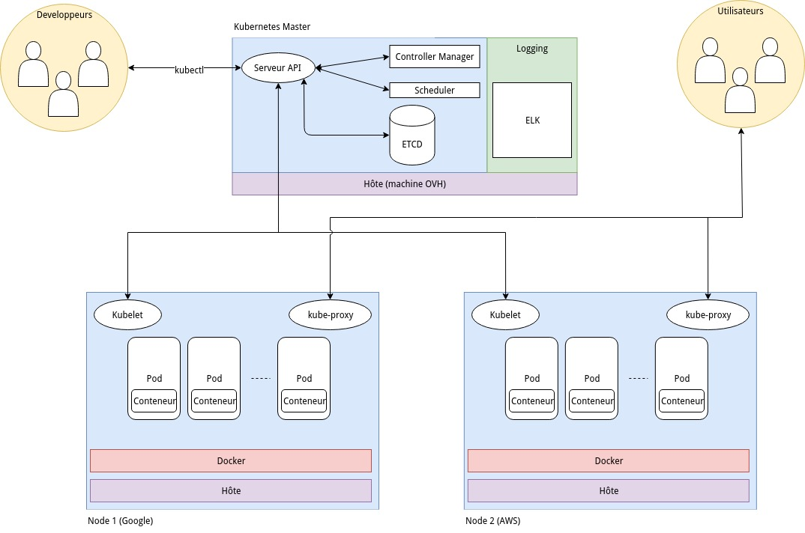
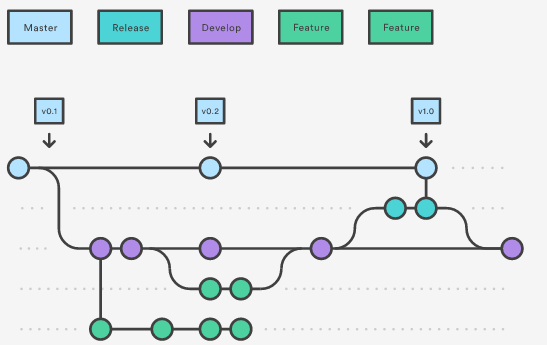

# Presentation de fin de formation DevOps

Cette présentation est une application nodejs dont le  déployement sur notre CaaS Kubernetes va être entièrement automatisée selon la méthodologie DevOps.

## Le support

Nous avons choisi Kubernetes comme support qui va nous permettre de déployer et gérer nos conteneurs de manière efficace. Nous pourrions utiliser une solution tout-en-un (GKE ou AWS) mais le but de ce TP est d'apprendre. Alors apprenons !

### Postulat de départ

Nous avons à notre disposition 3 providers qui nous fourniront les machines dont nous avons besoin.

- OVH : petite machine virtuelle payante. C'est celle qui as le plus de ressources. Elle soutiendra donc la machine maître (Master) de Kubernetes

- GCP : la PaaS de google. L'abonnement d'un an gratuit nous permet de creer une petite instance qui servira de noeud (node) Kubernetes

- AWS : la PaaS d'Amazon. Ici aussi l'instance virtuelle sera utilisé comme node.

Pour créer le cluster qui sera donc composé de 3 machines, nous pouvons :

- rester dans une optique classique et créer les instances sur les plateformes à la main puis installer les paquets nécessaires à Kubernetes

- honorer nos engagements d'automatisation dans l'esprit DevOps et utiliser des outils de création et d'approvisionnement des instances de support à Kubernetes.

Etant donné le nombre de serveurs impliqués dans notre projet, les deux approches sont valables et réalisables dans des temps d'implémentation similaires. Nous avons choisi la deuxième méthode qui, en plus de son intérêt pédagogique évident, nous permet une mise à l'échelle rapide et facilité.

### Quelques notions d'architecture

Avant de se lancer tête baissée dans la création de notre cluster, il est nécessaire de bien en comprendre le fonctionnement. Cela nous aidera pour mettre en place les bonnes pratiques liées au déployement de nos applications. Nous allons nous baser sur une architecture standard de Kubernetes :

- Serveur API : toutes les méthodes exposées par Kubernetes. l'API permet d'intéragir avec le cluster au moyen de JSON et de requêtes HTTP. Les requêtes mettent à jour l'état des objets stockés dans etcd. 

- Controller Manager : structure de contrôle qui régit l'état du cluster. Les requêtes API permettent d'indiquer au controlleur l'état désiré et le controlleur se charge d'y amener le cluster. 

- Scheduler : ou ordonnanceur en français permet de planifier les activités du cluster en fonction de la charge de travail, des performances et de la capacité du cluster. Il est assisté par les kubelets qui lui renseignent les performances du node sur lequel ils sont installés. 

- Etcd : la base de données qui stocke et gère les données de configuration du cluster. 

- kubectl : Kubernetes Command Line Tool. Permet d'utiliser l'API Kubernetes grâce à des commandes utilisables directement par les developpeurs.

- kubelet : gère l'état d'un noeud et prend en charge la gestion des conteneurs organisés dans les pods .

- Pod : un groupe d'un ou plusieurs conteneurs qui partagent des ressources de stockage et de réseau en commun. Les conteneurs au sein d'un même pod peuvent communiquer via localhost.

- Conteneur : contient une ou plusieurs applications avec tous les outils nécessaires pour les lancer. 

- kube-proxy : il fait office de proxy réseau et de répartiteur de charge. Il expose les ports nécessaire à la communication extérieure au cluster et route le traffic vers le conteneur approprié 

- Logging/ELK : la pile ElasticSearch, Logstash et Kibana qui va nous permettre d'avoir une solution d'analyse de log. 

### Le Workflow
> Git flow ou GitHub flow ? telle est la question...

Afin de limiter le chaos qu'engendre le développement collaboratif, il est crucial de décider d'un bon "flux de travail" ou workflow qui va définir la manière de gérer le tous les aspects de développement du projet.
Il existe plusieurs approches basées sur l'outil Git, le plus populaire étant Git flow.

Adapté pour la méthodologie agile, Git flow permet de gérer l'ajout de multiples fonctionnalités de manière indépendante sans intéragir directement avec la branche master. 

*Un exemple de git flow*

Le git flow préconise l'utilisation d'une branche **master** et d'une branche **develop**. La branche master est la branche de production, elle porte les tags de version et les commit n'y sont pas fréquents. La branche develop est la branche des développeurs, elle sert de branche de base pour les features et les releases. S'ajoutent à ces branches de base des branches éphémères aux buts bien définis :
- **feature** pour ajouter une fonctionnalité
- **release** pour faire tampon entre la branche **develop** et la branche **master**
- **hotfix** pour gérer les bugs en urgence directement depuis le **master**

Si ces méthodes sont idéales pour une mise en production controlée et organisée, elles s'apparentent dans notre cas à l'utilisation d'un bazooka pour tuer une mouche. D'autant plus que cette gestion n'est pas idéale dans le cas de commit fréquents sur le master.

Nous allons donc utiliser une version beaucoup plus légère appelée **Github flow**. En plus d'être plus intuitive et d'offrir une courbe d'apprentissage bien plus confortable, elle permet de gérer les processus de développement directement dans le navigateur, grâce à la puissance de Github.

Les étapes de Github flow s'articulent de cette manière :

- Création d'une branche depuis le repo
- Créer, éditer, supprimer des fichiers
- Envoyer une pull request  depuis la branche pour lancer une discussion entre dev
- Continuer les modification en mettant à jour la pull request
- Quand toutes les modifications sont prêtes, on les merge directement sur le master
- On supprime la branche
- Rinse and repeat

Cette méthode va nous permettre des itérations rapides et des déploiement fréquents, ce qui sera vital étant donné le temps restreint alloué au projet.

Maintenant que les objectifs et l'organisation du travail sont définis nous allons pouvoir nous attaquer à la construction de la structure.

### Creation des instances GCP et AWS

Nous allons utiliser l'outils de création et de gestion d'infrastructures Terraform. 